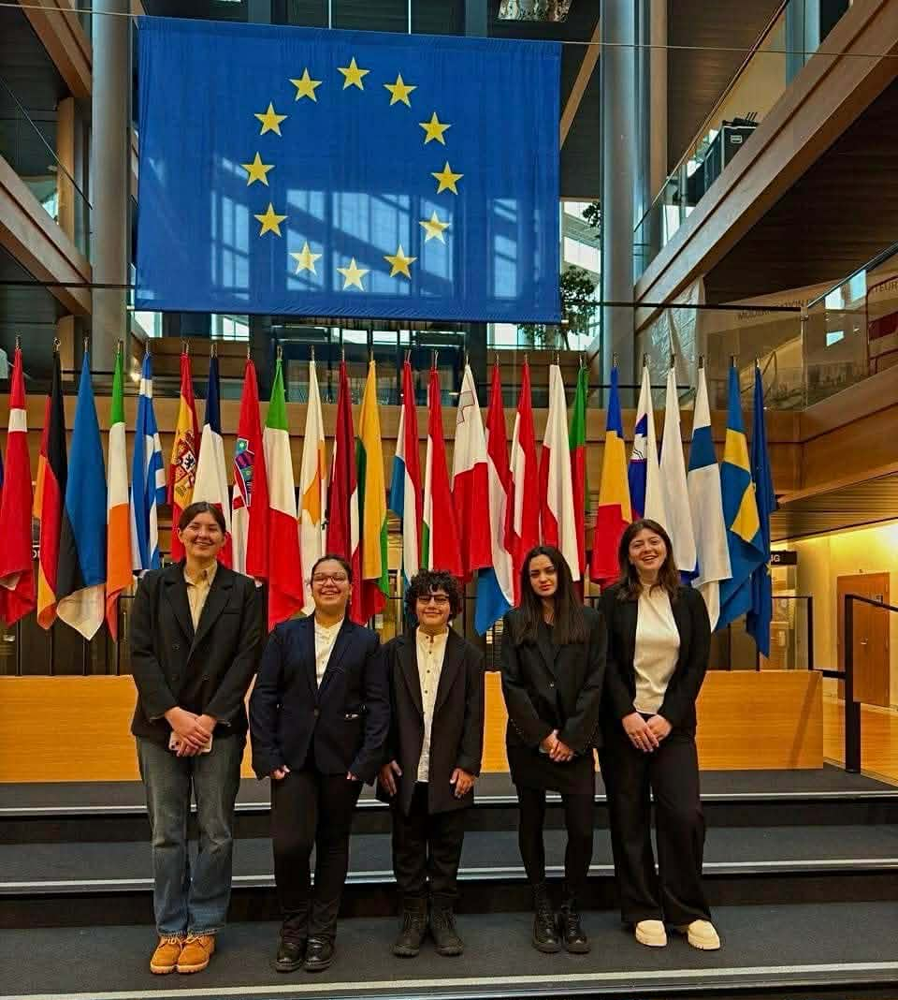
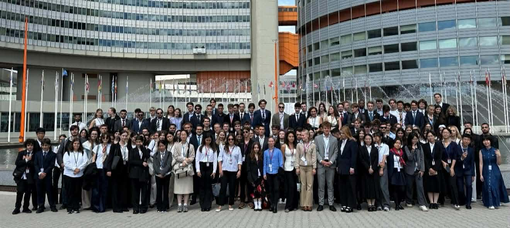
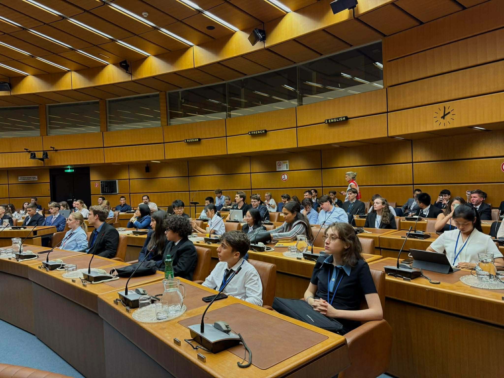
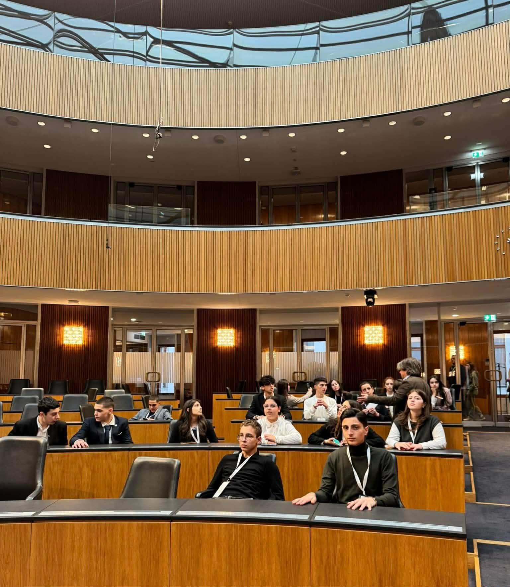
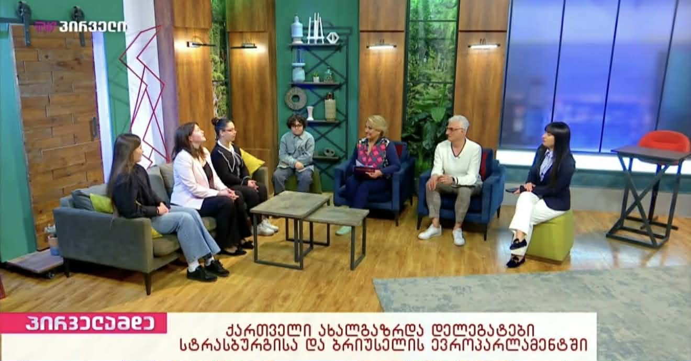

<!DOCTYPE html>
<html lang="ka">
<head>
    <meta charset="UTF-8">
    <meta name="viewport" content="width=device-width, initial-scale=1.0">
    <title>Global Education Network | Oxford Representative Georgia</title>
    
    
</head>
<body>

    <nav>
        

            
        

        <ul class="nav-links">
            <li><a href="#programs" id="nav-programs">პროგრამები</a></li>
            <li><a href="#mentors" id="nav-mentors">მენტორინგი</a></li>
            <li><a href="#academy" id="nav-academy">აკადემია</a></li>
            <li><a href="#gallery" id="nav-gallery">გალერეა</a></li>
            <li>
EN
</li>
        </ul>
    </nav>

    <header class="hero">
        <h1 id="hero-title">გლობალური განათლების ქსელი</h1>
        
ოქსფორდის პირველი და ერთადერთი ოფიციალური წარმომადგენელი საქართველოში

        <button class="btn" onclick="openApply()">რეგისტრაცია / Apply</button>
    </header>

    

        

            <i class="fas fa-eye"></i>
            <h3 id="card-1-title">ხედვა და მისია</h3>
            
აკადემიური ბრწყინვალება და ინოვაცია.

        

        

            <i class="fas fa-globe"></i>
            <h3 id="card-2-title">გლობალური პროგრამები</h3>
            
ჩაირიცხეთ მსოფლიოს წამყვან უნივერსიტეტებში.

        

        

            <i class="fas fa-graduation-cap"></i>
            <h3 id="card-3-title">ენობრივი აკადემია</h3>
            
IELTS და ბიზნეს ინგლისურის კურსები.

        

    

    <section id="programs">
        <h2 class="section-title" id="title-programs">საერთაშორისო მიმართულებები</h2>
        

            

                
                
United Kingdom

            

            

                
                
USA / International

            

            

                
                
Europe

            

        

    </section>

    <section id="mentors">
        <h2 class="section-title" id="title-mentors">აკადემიური გზამკვლევი</h2>
        

            

                Available
                <h3>გიორგი მ.</h3>
                
Ivy League Specialist

                <button class="btn" style="margin-top:15px">Request a Call</button>
            

            

                Booked (Waitlist)
                <h3>ანა კ.</h3>
                
Oxford/Cambridge Expert

                <button class="btn" style="margin-top:15px">No Slots</button>
            

            

                Available
                <h3>მარიამ ბ.</h3>
                
EU Public Policy Expert

                <button class="btn" style="margin-top:15px">Request a Call</button>
            

        

    </section>

    <section id="gallery">
        <h2 class="section-title">მედია არქივი</h2>
        

            
            
            
            
        

    </section>

    <footer>
        

            

                <h3>Global Education Network</h3>
                
ოქსფორდის წარმომადგენლობა საქართველოში.

            

            

                <h3>კონტაქტი</h3>
                
Email: info@gen.ge

                
Social: @gen_georgia

            

        

        
© 2026 GEN. All Rights Reserved.

    </footer>

    

        <i class="fas fa-edit"></i>
    

    
</body>
</html>
